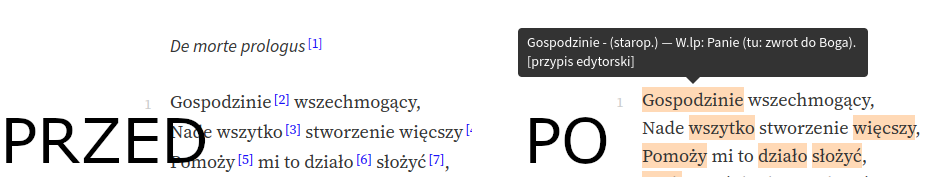

#  WolneLektury+ 

WolneLektury+ is an extension that adds useful functions to the reader on
[wolnelektury.pl](https://wolnelektury.pl).

## Features
### Better footnotes
By hovering the mouse over the selected words, the corresponding footnote will appear.
This removes the need to constantly scroll to the bottom of the page.

## Build
The built extension will be located in the `packages` folder.

Install npm packages before the first build: `npm install`

### Firefox
`npm run build-firefox`

### Chrome
`npm run build-chrome`

## Build (with auto-refresh)
### Firefox
`npm run dev-firefox`

### Chrome
`npm run dev-chrome`