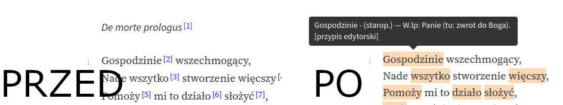

#  WolneLektury+ 

WolneLektury+ to rozszerzenie dodające użyteczne funkcje do czytnika na
stronie [wolnelektury.pl](https://wolnelektury.pl).

## Funkcje
### Przypisy
Po najechaniu myszką na zaznaczone wyrazy pojawi się odpowiadający przypis. 
Niweluje to potrzebę ciągłego zjeżdżania na sam dół strony.

## Budowanie
Zbudowane rozszerzenie będzie znajdować się w folderze `packages`.

Przed pierwszym budowaniem należy zainstalować paczki npm: `npm install`

### Firefox
`npm run build-firefox`

### Chrome
`npm run build-chrome`

## Budowanie (z auto-odświeżaniem)
### Firefox
`npm run dev-firefox`

### Chrome
`npm run dev-chrome`